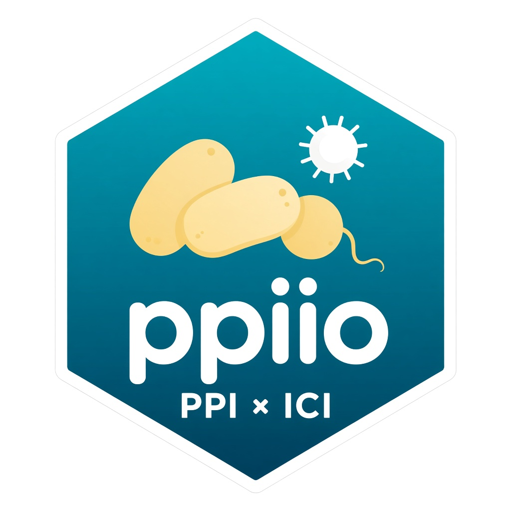
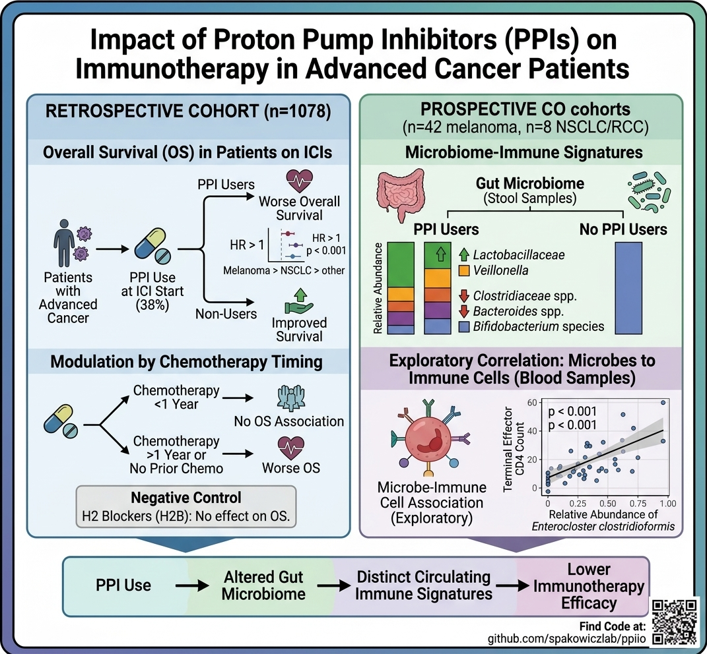

# ppiio [](https://doi.org/10.5281/zenodo.22827709)

Code and processed data for:

> Petouhoff, A., Hicks, R., Husain, M. et al. Impact of proton pump inhibitors on immunotherapy is modulated by prior chemotherapy and linked to gut microbiome–immune cell signatures. *Cancer Immunology, Immunotherapy* 75, 98 (2026). https://doi.org/10.1007/s00262-026-04346-7

The paper evaluates whether proton pump inhibitor (PPI) use is associated with overall survival in patients treated with immune checkpoint inhibitors (Cohort 1), and whether PPI use relates to gut microbiome composition (Cohort 2, melanoma) and circulating immune cells (Cohort 3, NSCLC/RCC).



## Repository structure

```
ppiio/
├── manuscript/          # Publication analyses (use these to regenerate figures/tables)
│   ├── scripts/         # R Markdown notebooks, one analysis per figure/table
│   ├── figures/         # SVG outputs written by the scripts below
│   ├── tables/          # Table 1 / S2 / S3 CSV outputs
│   └── data/            # Processed objects shipped with the repo (Cohorts 1–3)
├── processing/          # Cohort 3 shotgun pipeline (OSC PAS1695 → MetaPhlAn / HUMAnN3)
├── exploratory/         # Earlier drafts and unused analyses; not the publication pipeline
├── assets/              # README images (hex sticker, graphical abstract)
├── LICENSE
└── ppiio.Rproj
```

Publication figures and tables are produced **only** by scripts in `manuscript/scripts/`. Study-schema panels (Figures 1A, 3A, and 4A) were drawn for the paper and are not generated by code.

Raw extracts stay on the lab share. The share root is **not** in git: copy `manuscript/scripts/00-paths.R.example` to `manuscript/scripts/00-paths.R` (gitignored) and set:

- `Tdrive` — `ppiio` project folder on the share (contains `data/raw/` and `data/curated/`). Used by `Processing.Rmd`.
- `Iobio_clinical` — de-identified Cohort 3 clinical spreadsheet. Used only by Table S3 in `Table 1.Rmd`.
- `Iobio_sample_map` — CSV mapping Cohort 3 sequencer filename stems to study IDs. Keep on the share, not in git.

## Figure and table map

| Output | Script | Notes |
| --- | --- | --- |
| Figure 1B | `manuscript/scripts/Figure 1B Upset Plot.Rmd` | Concomitant-medication combinations |
| Figure 1C | `manuscript/scripts/Figure 1C Heatmap.Rmd` | Medication × cancer OS heatmap |
| Figures 1D–F, 2A–D | `manuscript/scripts/Figures 1 and 2 Survival Curves.Rmd` | Kaplan–Meier curves by PPI use |
| In-text HRs for 1D–F, 2A–D | `manuscript/scripts/Figures 1 and 2 Univariable Cox PH.Rmd` | Prints Cox results; no image file |
| Figure 2E | `manuscript/scripts/Figure 2D PPI_H2B_Timing.Rmd` | 30-day sliding-window HRs (filename is historical) |
| Figures 2F–G | `manuscript/scripts/Figure 2F 2G Multivariable Cox PH.Rmd` | PPI / H2B forest plots |
| Table 1, Tables S2–S3 | `manuscript/scripts/Table 1.Rmd` | Writes CSVs under `manuscript/tables/` |
| Figure 3B, 3E, 3F | `manuscript/scripts/Figures 3B 3E 3F .Rmd` | 3E–F load the saved ANCOM-BC2 object in `manuscript/data/Cohort_2/` |
| Figures 3C–D | `manuscript/scripts/Figure 3C 3D Diversity Analyses.Rmd` | Shannon and Bray–Curtis PCA |
| ANCOM-BC2 results (optional regenerate) | `manuscript/scripts/Figure 3 Cohort 2 ANCOM-BC2.Rmd` | Overwrites `manuscript/data/Cohort_2/ANCOM-BC2_response_baseline.RData` |
| Figures 4B–D | `manuscript/scripts/Figure 4.Rmd` | Phylum bars, CyTOF heatmap, *E. clostridioformis* vs TE CD4 |
| Figure S3A–G | `manuscript/scripts/Supp Figure 3.Rmd` | H2B Kaplan–Meier curves (same strata as PPI) |
| Cohort 1 cleaned clinical file | `manuscript/scripts/Processing.Rmd` | Writes `manuscript/data/cohort1-cleaned-clinical.RDS` |

## Data locations

### Cohort 1 (all-cancers retrospective; Figures 1–2, Table 1, Figure S3)

The **cleaned clinical object** is `manuscript/data/cohort1-cleaned-clinical.RDS` (1,095 patients after the eligibility filters in `Processing.Rmd`; the published text reports 1,078). It has no MRNs, names, dates of birth, or calendar dates. `Processing.Rmd` builds it from lab-share extracts via `Tdrive`. Figure scripts `select()` only the columns needed for that panel.

Variables in the RDS:

| Variable | Used in |
| --- | --- |
| `ppi`, `statin`, `h2b_iostart`, `steroid_iostart`, `abx_iostart`, `nsaid_iostart` | Figure 1B; Figure 1C; Figures 2F–G; Figure S3 |
| `days`, `vitalstatus` | Figures 1D–F, 2A–G, S3; Cox models |
| `cancer.name`, `Cancer`, `Immunotherapy` | Figure 1C; Table 1 |
| `PPI.days.to.iostart`, `H2B.days.to.iostart`, `ABX.days.to.iostart` | Figure 1C; Figure 2E (relative days on drug, not calendar dates) |
| `staging`, `cci_number`, `line_of_therapy`, `prior_chemo`, `chemo_greater_one_year`, `ecog`, `age`, `follow_up`, `sex` | Table 1; stratified and multivariable survival models |

### Cohort 2 (melanoma microbiome; Figure 3, Table S2)

Processed objects live in `manuscript/data/Cohort_2/`:

| File | Contents |
| --- | --- |
| `clinical.rds` | `demographics`: `Patient Id`, `Age`, `Sex`, `Treatment`, `Stage`, `PPI` |
| `mitox_microbiome_metadata.rds` | `mic.meta`: `sample`, `Patient Id`, `Days` (days relative to ICI start) |
| `ra-long.rds` / `ra-wide.rds` | Species/phylum relative abundances |
| `counts-long.rds` / `counts-wide.rds` | Estimated read counts |
| `phylum-labels.rds` | Taxon-to-phylum map |
| `ANCOM-BC2_response_baseline.RData` | Differential-abundance results used by Figures 3E–F |

Patient IDs are study codes (e.g. `M001`), not medical-record numbers.

### Cohort 3 (NSCLC/RCC microbiome + CyTOF; Figure 4, Table S3)

Processed objects live in `manuscript/data/Cohort_3/`:

| File | Contents |
| --- | --- |
| `2023-12-07_mpa-aggregate.csv` | MetaPhlAn relative abundances; sample IDs are study codes (`P026_d0`, …) with days relative to ICI start |
| `cytof_normalized.RDS` | Normalized CyTOF abundances; `Patient ID` is `26 _ 0` (patient and day relative to ICI start) |
| `clinical.csv` | PPI use (`Y`/`N`) for the eight patients in Figure 4 |

Shotgun reads were processed on OSC (project **PAS1695**) with HUMAnN 3; MetaPhlAn tables come from that run. Scripts and aggregated outputs are in `processing/`. There are 14 libraries (8 baseline, 4 follow-up, 2 controls); Figure 4 uses the 8 baselines. Sample IDs in the committed CSVs are study codes, not sequencer filenames. The sequencer-to-study-ID key (`iobio-sample-key.csv`) stays on the lab share (`Tdrive`) and on OSC; it is not in git.

Table S3 demographics are rebuilt in `Table 1.Rmd` from `Iobio_clinical` in `00-paths.R` (Gender, vital status, ECOG, immunotherapy class, and PPI only).

## Regenerating figures

1. Open `ppiio.Rproj` in RStudio (or set the working directory to the repo root).
2. Knit the notebook for the figure of interest. Figures 3E–F use the ANCOM-BC2 results already stored in `manuscript/data/Cohort_2/`; knit `Figure 3 Cohort 2 ANCOM-BC2.Rmd` only to rebuild that object.
3. To rebuild the Cohort 1 RDS, create `manuscript/scripts/00-paths.R` from the example file and knit `Processing.Rmd`.
4. SVG files are written to `manuscript/figures/`.

`exploratory/` contains prior versions of these analyses and should not be used to reproduce the published figures. Those scripts still point at the lab share and are not needed to regenerate the paper.
